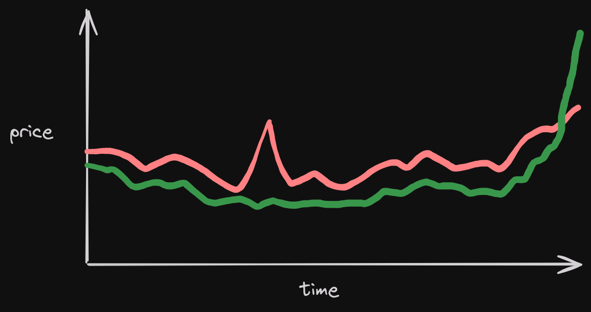

# Price Oracle

For futarchy to work, you need a way of extracting the price of a proposal's conditional market.

The naive approach is to just use the spot price at the time of proposal finalization. But this is highly manipulable. For example, someone could pump the price of the pass market right before finalization in order to force the proposal to pass.

<figure><figcaption>
Someone could bid up the pass price in the last minute to force a proposal through
</figcaption></figure>

### TWAP

Less naive is to use a time-weighted average price (TWAP). TWAPs are much harder to manipulate. For example, if TOKEN's pass price is $100 for the first 72 hours of a proposal and then a manipulator pushes the price to $1000 for the last 15 minutes, the TWAP would be $103.11, only a 3% difference from the 'true price.'

However, TWAPs also have their flaws. Importantly, Solana validators can manipulate TWAPs by setting the price extremely high for a few slots. Because the validator controls the slot, they know that noone would be able to sell into their extremely high price. If a validator controls 1% of slots, they could force a proposal through by 100xing the pass price during their slots.

### Lagging price TWAP

We deal with this by using a special form of TWAP we call a lagging price TWAP. In a lagging price TWAP, the number that gets fed into the TWAP isn't the raw price - it's a number that tries to approximate the price but which can only move a certain amount per update. We call this an _observation_. Each DAO must configure the _first observation_ and _max observation change per update_ that get used in its proposals' markets.

<figure><figcaption></figcaption></figure>

To take an example, imagine that MetaDAO's first observation is set to $500 and its max change per update is $5. If a proposal opens with a pass market of $550, it will take 10 updates before the observation accurately reflects the price. Assuming each update is spaced evenly and the price stays at $550, the TWAP after 10 updates will be $527.5 (\[$505 + $510 + $515 + $520 + $525 + $530 + $535 + $540 + $545 + $550] / 10). After 10 more updates, it will be $538.75.

### One minute between updates

Ideally, the TWAP would be highly sensitive to normal price movements and highly insensitive to manipulated price movements. We originally allowed one update per slot, but this gives the opposite effect: an attacker may be able to land in every slot, whereas normal trading activity isn't as frequent (yet!), so an attacker would move the price more than genuine price movements. To deal with this, we only allow one update per minute.
