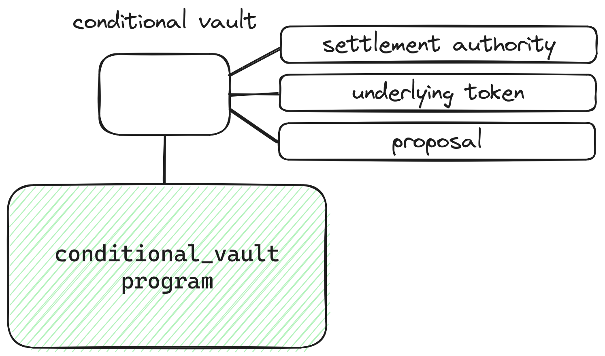

# Program Architecture

We implement futarchy via three programs:

* **Conditional vault:** what allows the creation of conditional tokens.
* **AMM:** allows the creation of AMM-based conditional markets. Provides a time-weighted average price oracle.
* **Autocrat:** the program that coordinates futarchy. Allows the creation of DAOs and proposals, and allows proposals to be finalized based on the prices in the conditional markets.

### Conditional vault program 

For a decision market to work, you must revert all of the market's trades when the condition isn't met. This is what allows speculators to place trades like "I would pay $5,000 for 10 META if this proposal passes."

Blockchains like Solana don't allow you to revert transactions after they've been finalized, so we need a mechanism to _simulate_ reverting transactions. That mechanism is conditional tokens.

Conditional tokens are tied to _conditional vaults_. Each conditional vault has a specific _underlying token, settlement authority,_ and _proposal_. In the case of futarchy, the underlying token would be either USDC or the DAO's token, the settlement authority would be the DAO's treasury, and the proposal would be a proposal to the DAO.

<figure><figcaption></figcaption></figure>

Once a vault is created, anyone can deposit underlying tokens in exchange for conditional tokens. You receive two types of conditional tokens: ones that are redeemable for underlying tokens if the vault is finalized and ones that are redeemable for underlying tokens if the vault is reverted. For example, if you deposit 10 USDC into a vault, you will receive 10 conditional-on-finalize USDC and 10 conditional-on-revert USDC.

<figure><figcaption></figcaption></figure>

The settlement authority can either _finalize_ or _revert_ a vault.

If the settlement authority finalizes a vault, users can redeem their conditional-on-finalize tokens for underlying tokens. Conversely, if the settlement authority reverts a vault, users can redeem their conditional-on-revert tokens for underlying tokens.

<figure><figcaption></figcaption></figure>

There are two vaults for each proposal: a base vault and a quote vault. The base vault uses the DAO's token as the underlying token, and the quote vault uses USDC as the underlying token. For example, MetaDAO proposals have vaults for META and USDC.

If the proposal passes, both vaults are finalized. If it fails, both are reverted.

<figure><figcaption></figcaption></figure>

This allows us to achieve the desired reverting of trades. For example, if someone mints conditional-on-pass META and trades it for conditional-on-pass USDC, either the proposal will pass and they can redeem conditional-on-pass USDC for USDC or the proposal will fail and they can redeem their conditional-on-fail META for their original META.

So we create two markets per proposal: one where conditional-on-pass META is traded for conditional-on-pass USDC and one where conditional-on-fail META is traded for conditional-on-fail USDC. This allows traders to express opinions like “this token would be worth $112 if the proposal passes, but it’s only worth $105 if the proposal fails.”

<figure><figcaption></figcaption></figure>

### AMM 

Decision markets are facilitated through a constant-product AMM.&#x20;

Importantly, this AMM provides an on-chain time-weighted average price (TWAP) oracle that can be used by autocrat to determine when to pass or fail proposals. The oracle follows the same design as [Uniswap V2](https://docs.uniswap.org/contracts/v2/concepts/core-concepts/oracles), and uses several additional mechanisms to ensure manipulation-resistance.

### Autocrat 

The last piece of the puzzle is _autocrat_, the program that orchestrates futarchy.

Anyone can interact with autocrat to create a _proposal_, which contains fields such as a proposal number, proposal description link, and an executable Solana Virtual Machine (SVM) instruction. For example, someone could create a proposal to transfer 150,000 USDC to a development team to improve a product that’s managed by a DAO.

The requisite conditional vaults and markets are created at the same time.

<figure><figcaption></figcaption></figure>

After a configurable amount of time (3 days by default), anyone can trigger proposal finalization. In finalization, autocrat checks if the TWAP of the pass market is x% higher than the TWAP of the fail market, where x is a DAO-configured threshold.

&#x20;If it is, it finalizes the pass market, reverts the fail market, and allows the SVM instruction to be executed. If it isn’t, it reverts the pass market, finalizes the fail market, and does not allow the SVM instruction to be executed.
