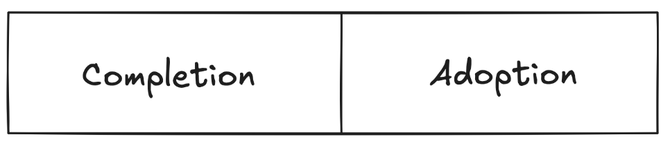

# {{examplerubric}}
{{acme-corp-is-the-developer-of-an-innovative-l1-blockchain-written-in-fortran}}. {{to-bootstrap-its-ecosystem-acme-funds-teams-with-100k-grants}}.

{{acme-retroactively-grades-grants-on-two-criteria-project-completion-and-project-adoption}}. {{each-of-these-is-half-the-weight-of-a-grants-score}}.

<figure><figcaption></figcaption></figure>

## {{completion}}{{projects-can-receive-a-0-to-0.5-completion-score}}. {{heres-how-the-number-is-determined}}:

- {{0-this-project-essentially-ran-off-with-the-money-releasing-nothing-publicly}}.
- {{0.25-this-project-did-not-launch-but-developed-part-of-the-product-theres-a-codebase-that-another-project-would-be-able-to-use}}.
- {{0.5-this-project-fully-launched}}.

## {{adoption}}{{projects-can-receive-a-0-to-0.5-adoption-score}}. {{heres-how-the-number-is-determined}}:

- {{0-if-its-a-consumer-product-50-people-or-less-have-used-this-product-if-its-a-defi-product-its-acquired-less-than-50k-in-tvl}}.
- {{0.5-if-its-a-consumer-product-500-people-or-less-have-used-this-product-if-its-a-defi-product-its-acquired-less-than-500k-in-tvl}}.
- {{1-if-its-a-consumer-product-2500-people-or-more-have-used-it-if-its-a-defi-product-its-acquired-more-than-2.5m-in-tvl}}.

## {{methodology}}{{grants-are-scored-by-a-grants-committee-of-5-people-3-from-acme-and-2-from-metadao}}. {{the-total-score-is-computed-by-averaging-the-scores-of-the-5-committee-members}}.

## {{timeline}}{{grants-are-scored-3-months-after-the-grant-has-been-given}}.
