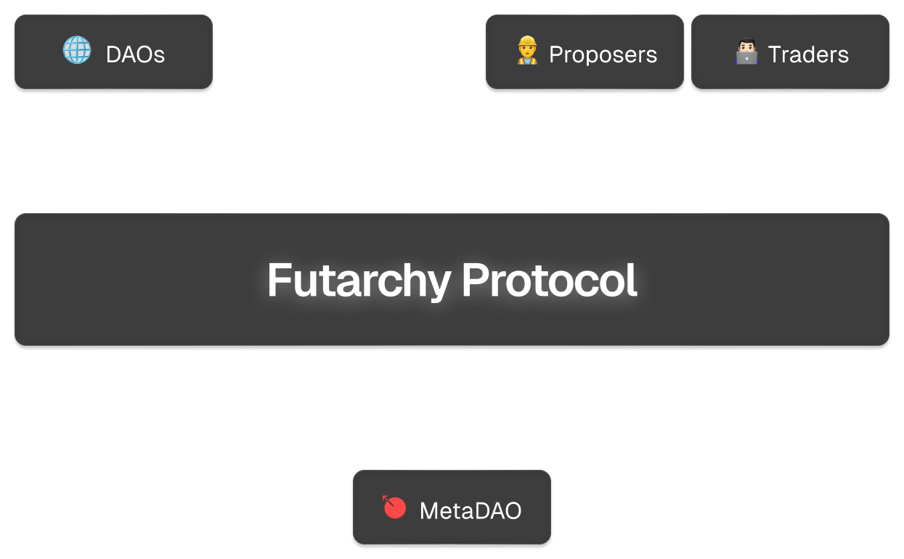

# 介绍
<figure><figcaption></figcaption></figure>

### 问题
投票不起作用。理论上，投票应该是一个理性的过程，选民选择最佳选项。但在实践中，投票系统存在三个大问题：

* **参与度低：** 很难让人们参与投票。
* **不知情的投票者**：即使你能让人们投票，他们对当前决策的理解也常常非常有限。
* **鲸鱼和内部人士的影响**：内部人士可以对投票结果产生巨大影响。加密领域充斥着“治理戏剧”。

在过去的七千年里，人们进行了许多尝试来改进投票机制。然而，到目前为止，这些尝试都没有带来实质性的改进。

### 未来统治
人们常说，买东西用脑子，但投票用心。如果我们可以颠覆这一点，利用市场流程来做决策呢？这就是**futarchy**背后的核心理念。

在一个未来治理体系中，决策不是通过投票，而是通过交易来实现。当市场预测提案是好的时，提案就会通过。当市场预测提案是不好的时，提案就会失败。

### MetaDAO
尽管福塔克（futarchy）是由经济学家罗宾·汉森（Robin Hanson）在2000年发明的，MetaDAO是第一个将其付诸实践的项目。它提供了一个创建、管理和参与福塔克的平台，并且本身也由福塔克治理。
