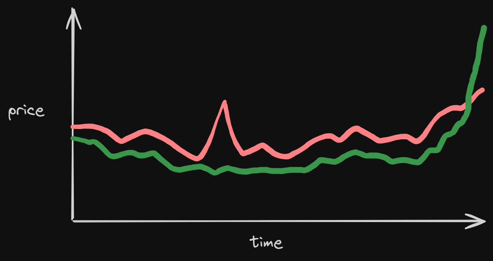
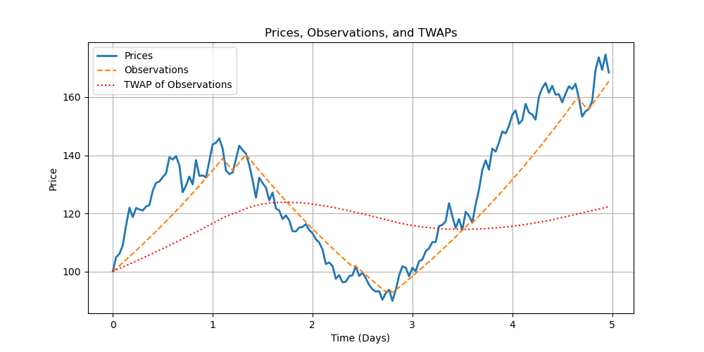

# 价格预言机
为了让 futarchy 发挥作用，您需要一种提取提案条件市场价格的方法。

一种简单的方法是仅在提案最终确定时使用现货价格。但这很容易被操控。例如，有人可能会在最终确定之前抬高通行市场的价格，以迫使提案通过。

<figure><figcaption>
有人可能会在最后一分钟提高通过价格，以强行通过提案
</figcaption></figure>

### 时间加权平均价格
更不幼稚的方法是使用时间加权平均价格（TWAP）。TWAPs 更难操控。例如，如果 TOKEN 的通过价格在提案的前 72 小时为 $100，然后操控者在最后 15 分钟将价格推至 $1000，那么 TWAP 将为 $103.11，仅比“真实价格”高出 3%。

然而，TWAPs 也有其缺陷。重要的是，Solana 验证者可以通过在几个时段内将价格设置得极高来操纵 TWAPs。由于验证者控制着时段，他们知道没有人能够以他们极高的价格进行出售。如果一个验证者控制了 1% 的时段，他们可以在自己的时段内将通过价格提高 100 倍，从而强行通过一个提案。

### 滞后价格时间加权平均价格 (TWAP)
我们通过使用一种特殊形式的时间加权平均价格（TWAP）来处理这个问题，我们称之为滞后价格TWAP。在滞后价格TWAP中，输入到TWAP的数字不是原始价格，而是一个尝试近似价格的数字，但每次更新只能移动一定的量。我们称之为一个_观察_。每个DAO必须配置其提案市场中使用的_首次观察_和_每次更新的最大观察变化_。

<figure><figcaption></figcaption></figure>

举个例子，假设MetaDAO的初始观察值设定为$500，每次更新的最大变化为$5。如果一个提案以$550的通过市场价格开启，那么需要10次更新后观察值才能准确反映价格。假设每次更新间隔均匀且价格保持在$550，10次更新后的TWAP将为$527.5（\[$505 + $510 + $515 + $520 + $525 + $530 + $535 + $540 + $545 + $550] / 10）。再经过10次更新后，它将是$538.75。

### 更新之间间隔一分钟
理想情况下，TWAP 对正常价格波动高度敏感，而对操纵价格波动高度不敏感。我们最初允许每个时段进行一次更新，但这产生了相反的效果：攻击者可能能够在每个时段都进行操作，而正常交易活动并不那么频繁（至少目前如此！），因此攻击者会比真实的价格波动更能影响价格。为了解决这个问题，我们只允许每分钟进行一次更新。
