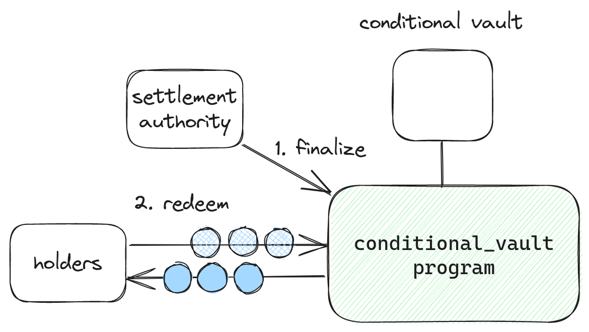

# 程序架构
我们通过三个程序实现Futarchy：

* **条件性保险库:** 允许创建条件性代币的功能。
* **AMM:** 允许创建基于AMM的条件市场。提供一个时间加权平均价格预言机。
* **Autocrat（自动统治者）:** 协调Futarchy的程序。允许创建DAOs和提案，并允许根据条件市场中的价格来最终确定提案。

### 条件性保险库程序 Conditional vault program 
要使决策市场正常运作，当条件未满足时，您必须撤销市场的所有交易。这就是允许投机者进行像'如果这个提案通过，我愿意支付$5,000购买10个META'这样的交易的原因。

像Solana这样的区块链不允许你在交易被最终确定后撤销交易，所以我们需要一种机制来_模拟_撤销交易。这种机制就是条件性代币。

条件性代币与_条件性金库_相绑定。每个条件性金库都有特定的_基础代币，结算权威，_和_提案_。在Futarchy的情况下，基础代币将是USDC或DAO的代币，结算权威将是DAO的财政部，提案将是向DAO的提案。

<figure><figcaption></figcaption></figure>

一旦创建了保险库，任何人都可以存入基础代币以换取条件代币。您会收到两种类型的条件代币：如果保险库被最终确定，可以兑换为基础代币的代币，以及如果保险库被撤销，可以兑换为基础代币的代币。例如，如果您向保险库存入10个USDC，您将收到10个在最终确定条件下的USDC和10个在撤销条件下的USDC。

<figure><figcaption></figcaption></figure>

结算权威可以选择 _finalize_ 或者 _revert_ 一个金库。

如果结算权威机构最终确定了一个保险库，用户可以兑换他们的条件决定性代币以获取基础代币。相反，如果结算权威机构撤销了一个保险库，用户可以兑换他们的条件撤销性代币以获取基础代币。

<figure><figcaption></figcaption></figure>

每个提案都有两个金库：基础金库和报价金库。基础金库使用DAO的代币作为基础代币，报价金库使用USDC作为基础代币。例如，MetaDAO的提案有META和USDC的金库。

如果提案通过，两个保险库都将被确定。如果失败，两者都将被撤销。

<figure><figcaption></figcaption></figure>

这使我们能够实现所需的交易回滚。例如，如果有人铸造了有条件通过的META并用它交换了有条件通过的USDC，那么提案要么会通过，他们可以用有条件通过的USDC兑换USDC，要么提案会失败，他们可以用有条件失败的META兑换他们原来的META。

因此，我们为每个提案创建两个市场：一个是在提案通过的条件下交易META和USDC，另一个是在提案失败的条件下交易META和USDC。这使交易者能够表达如“如果提案通过，这个代币将值112美元，但如果提案失败，它只值105美元。”这样的观点。

<figure><figcaption></figcaption></figure>

### 自动做市商 
决策市场是通过恒定产品自动做市商（AMM）来促进的。&#x20;

重要的是，这个AMM提供了一个链上的时间加权平均价格(TWAP)预言机，可以被autocrat用来决定何时通过或否决提案。这个预言机遵循与[Uniswap V2](https://docs.uniswap.org/contracts/v2/concepts/core-concepts/oracles)相同的设计，并使用了几种额外的机制来确保防止操纵。

### 自动统治者  
谜题的最后一块是_autocrat_，这是一个协调Futarchy的程序。

任何人都可以与autocrat交互，创建一个_提案_，其中包含诸如提案编号、提案描述链接以及可执行的Solana虚拟机(SVM)指令等字段。例如，有人可以创建一个提案，将150,000 USDC转移到一个开发团队，以改进由DAO管理的产品。

必要的条件性保险库和市场同时创建。

<figure><figcaption></figcaption></figure>

在可配置的时间段后（默认为3天），任何人都可以触发提案的最终确定。在最终确定过程中，autocrat会检查通过市场的TWAP是否比失败市场的TWAP高出x%，其中x是DAO配置的阈值。

如果是，它将完成通过市场的最终决定，撤销失败市场，并允许执行SVM指令。如果不是，它将撤销通过市场，完成失败市场的最终决定，并不允许执行SVM指令。
