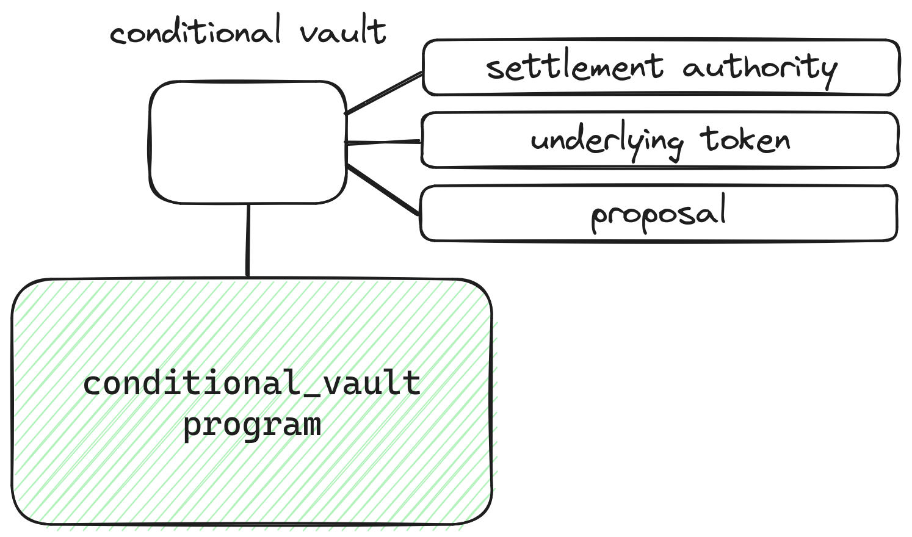
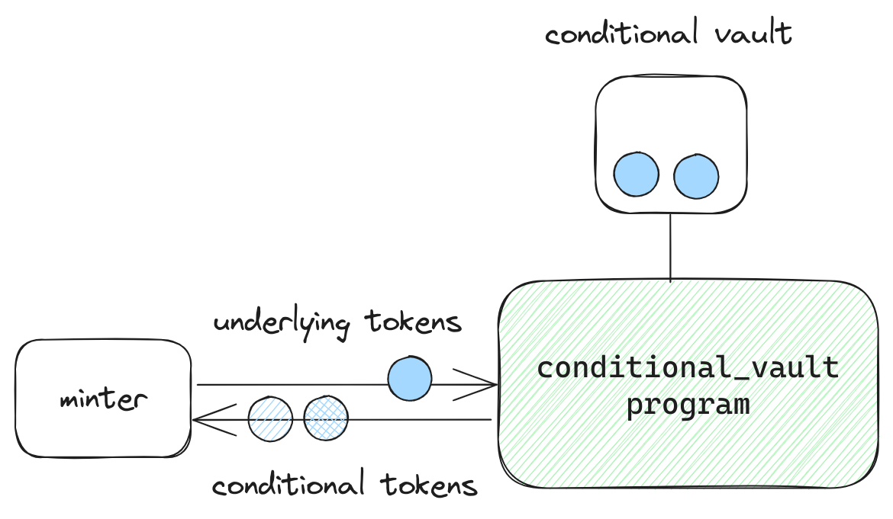
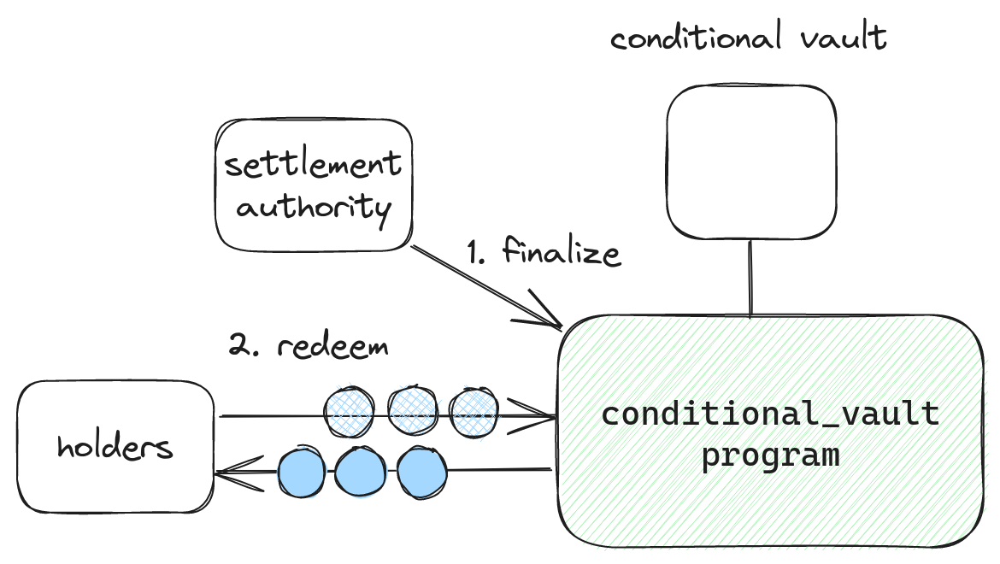
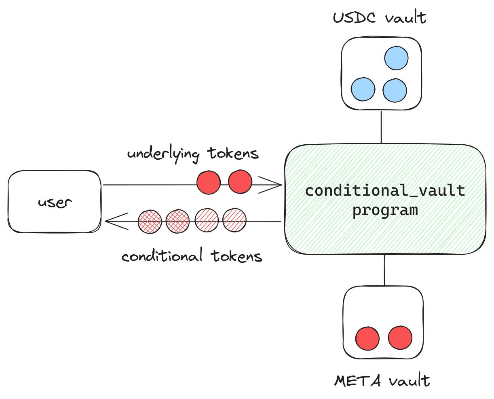
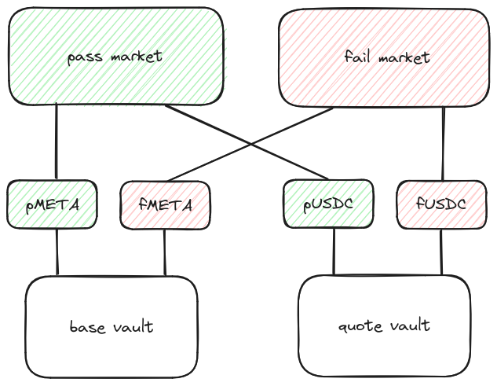
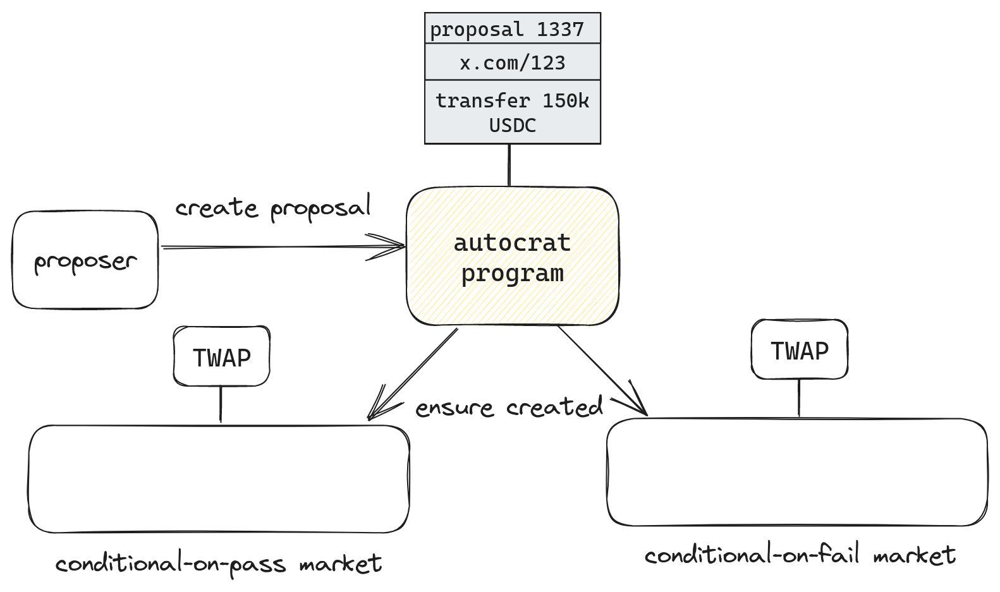

# 程序架构
我们通过三个程序实现未来统治：

* **条件保险库：** 允许创建条件代币的机制。
* **AMM:** 允许创建基于AMM的条件市场。提供时间加权平均价格预言机。
* **Autocrat：** 协调未来治理的程序。允许创建去中心化自治组织（DAO）和提案，并根据条件市场中的价格来最终确定提案。

### 条件金库程序 Conditional vault program 
为了让决策市场发挥作用，当条件不满足时，您必须撤销市场的所有交易。这就是为什么投机者可以进行类似于“如果这个提案通过，我愿意支付5,000美元购买10个META”的交易。

像 Solana 这样的区块链在交易完成后不允许你撤销交易，因此我们需要一种机制来_模拟_撤销交易。该机制就是条件代币。

条件代币与_条件金库_相关联。每个条件金库都有特定的_基础代币、结算权威_和_提案_。在未来治理的情况下，基础代币可以是USDC或DAO的代币，结算权威是DAO的金库，而提案则是向DAO提交的提案。

<figure><figcaption></figcaption></figure>

一旦创建了一个金库，任何人都可以存入基础代币以换取条件代币。您将收到两种类型的条件代币：一种是在金库最终确定时可兑换为基础代币的代币，另一种是在金库被撤销时可兑换为基础代币的代币。例如，如果您向金库存入10 USDC，您将收到10个条件-最终确定的USDC和10个条件-撤销的USDC。

<figure><figcaption></figcaption></figure>

结算权限可以 _最终确定_ 或 _撤销_ 一个金库。

如果结算机构最终确定了一个金库，用户可以将他们的条件性最终确定代币兑换为基础代币。相反，如果结算机构撤销了一个金库，用户可以将他们的条件性撤销代币兑换为基础代币。

<figure><figcaption></figcaption></figure>

每个提案有两个金库：一个基础金库和一个报价金库。基础金库使用DAO的代币作为基础代币，而报价金库使用USDC作为基础代币。例如，MetaDAO的提案有META和USDC的金库。

如果提案通过，两个金库都将被最终确定。如果提案未通过，两个金库都将被撤销。

<figure><figcaption></figcaption></figure>

这使我们能够实现所需的交易回滚。例如，如果有人铸造了通过条件的 META 并将其交易为通过条件的 USDC，那么要么提案通过，他们可以将通过条件的 USDC 兑换为 USDC，要么提案失败，他们可以将失败条件的 META 兑换为原始的 META。

因此，我们为每个提案创建两个市场：一个市场是条件通过的 META 交易条件通过的 USDC，另一个市场是条件失败的 META 交易条件失败的 USDC。这使得交易者可以表达这样的观点：“如果提案通过，这个代币的价值将是 $112，但如果提案失败，它的价值只有 $105。”

<figure><figcaption></figcaption></figure>

### 自动做市商 
决策市场通过恒定乘积AMM进行促进。

重要的是，这个AMM提供了一个链上时间加权平均价格（TWAP）预言机，autocrat可以使用它来决定何时通过或否决提案。该预言机遵循与[Uniswap V2](https://docs.uniswap.org/contracts/v2/concepts/core-concepts/oracles)相同的设计，并使用了几种额外的机制来确保抗操纵性。

### 独裁者  
拼图的最后一块是_autocrat_，即协调futarchy的程序。

任何人都可以与autocrat互动来创建一个_提案_，其中包含提案编号、提案描述链接和可执行的Solana虚拟机（SVM）指令等字段。例如，有人可以创建一个提案，将150,000 USDC转移给开发团队，以改进由DAO管理的产品。

必要的条件金库和市场同时创建。

<figure><figcaption></figcaption></figure>

在一个可配置的时间段后（默认3天），任何人都可以触发提案的最终确定。在最终确定过程中，autocrat会检查通过市场的TWAP是否比失败市场的TWAP高出x%，其中x是DAO配置的阈值。

如果是这样，它将完成通过市场，恢复失败市场，并允许执行 SVM 指令。如果不是，它将恢复通过市场，完成失败市场，并且不允许执行 SVM 指令。
