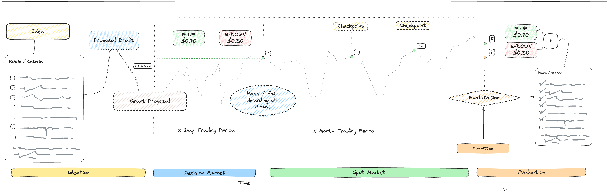
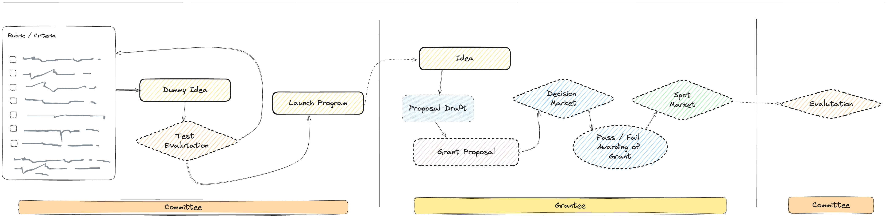
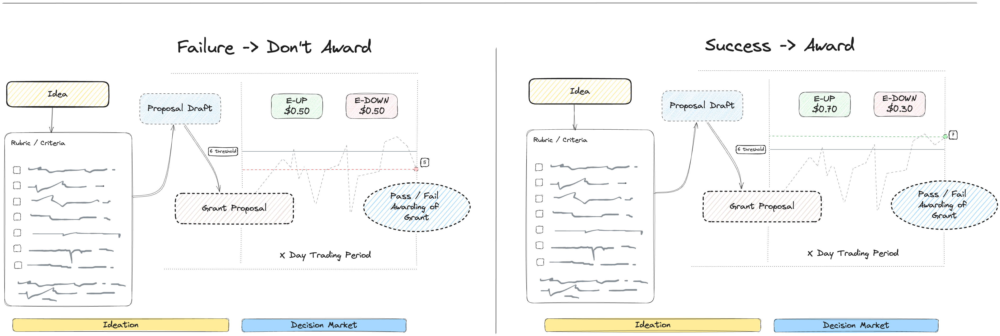
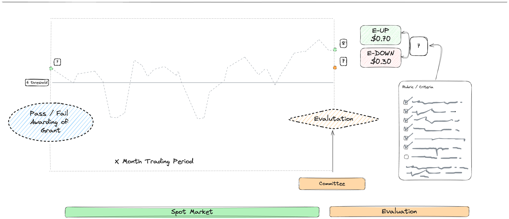

# 价值解决决策市场
MetaDAO 的基于价值的决策制定程序适用于许多不同的应用。在 Hanson 的论文中，他建议我们对价值进行投票，但对信念进行下注，因此这是朝着该方向迈出的迭代步骤。

在某些情况下，基础价值可能无法直接衡量（对业务的价值增值），但可以在一个标准框架内离散地衡量，或者许多价值可能会被整体评估。

汉森关于 GDP、健康、休闲、幸福和环境的例子都是可以通过使用该系统而受到影响的衡量标准的例子。虽然你可能无法在任何实际意义上交易健康，但这些专业化合约会根据未来衡量标准相对于价值的情况进行支付。

这些市场必须得到解决，为此我们提出一个与当前现有的委员会、董事会或DAO成员一致的初步结构。这些成员将负责根据一个健全的框架或评分标准执行测量。

随着预言机和链上数据的进步，自动化解决方案的实用性在未来某个时候将成为可能。然而，目前的实现是围绕现状的灵活性而设计的。

您希望看到哪些想法被评估，或者您有兴趣尝试哪些示例？ {{Join the}} [{{MetaDAO Discord}}](https://discord.gg/metadao) {{and let us know!}}

## 示例我们根据消费者需求设计了产品，但绝不仅限于这些例子。

### 资助
以下是用于资助计划的指南，以及如果您想实施该系统所需的内容。

<figure><figcaption></figcaption></figure>

#### 先决条件首先，MetaDAO 需要以下内容：

- 标准: 用于评估资助效果的标准。 这就是交易者用来为资助定价并决定是否应允许其通过的依据。一个例子在[这里](../examples/rubric.md)。
- 期望的最低流动性：您希望在资助市场中看到的最低流动性是多少。我们建议在 $2k 到 $20k 之间，其中最低流动性至少是资助平均预期规模的 20%。更多的流动性意味着更强的激励来正确定价市场。
- 期望的资助金额：受资助者应能够申请的金额，以及这是固定的还是有一个可申请的范围。
- 期望阈值：根据您的标准，在授予资助之前，您希望市场对其进行评估的有效程度。例如，“50%”或“85%”。
- 交易期：市场运行的时间长度。我们建议为3天。

#### 资助生命周期<figure><figcaption></figcaption></figure>
在我们的系统中，资助经历几个阶段：

- 创意构思
- 决策市场
- 现货市场
- 解决方案

##### 构思首先，需要有人提出一个潜在资助的想法。一旦他们决定愿意去做，他们就会撰写一份资助提案。这个提案可以选择遵循您自己的模板。

##### 决策市场<figure><figcaption></figcaption></figure>
一旦潜在的受赠者撰写了他们的资助提案，我们会帮助他们创建一个决策市场。

在决策市场中，交易者会交易如果授予该资助，其效果评分会是多少？

人们可以通过购买 E-UP 代币来押注某项资助将会有效。他们可以通过购买 E-DOWN 代币来押注某项资助将会无效。这类似于预测市场交易者购买 YES 和 NO 代币。E-UP 代币根据资助的有效性支付，而 E-DOWN 则支付相反的结果。例如，如果某项资助被认为是 78% 有效，E-UP 将支付 $0.78，而 E-DOWN 将支付 $0.22。

E-UP 的市场价格代表了市场对资助效果的看法。

在交易期结束后，资助将被接受或拒绝。如果被拒绝，所有交易者将收回他们的钱，并且不会有资金发送给受助人。如果被接受，资金将通过您喜欢的任何方式发送（例如，通过Squads多重签名）。

##### 现货市场<figure><figcaption></figcaption></figure>
如果授予了资助，我们会保持 E-UP 和 E-DOWN 市场开放。这允许交易者在市场已经反映他们的信念时清算他们的头寸。这也使市场能够持续评估受资助者。

##### 决议在评分标准中指定的时间段结束后，拨款将被评分。其分数被输入到一个预言机中，以便交易者可以将他们的E-UP和E-DOWN兑换成现金。这就结束了整个过程和市场。
